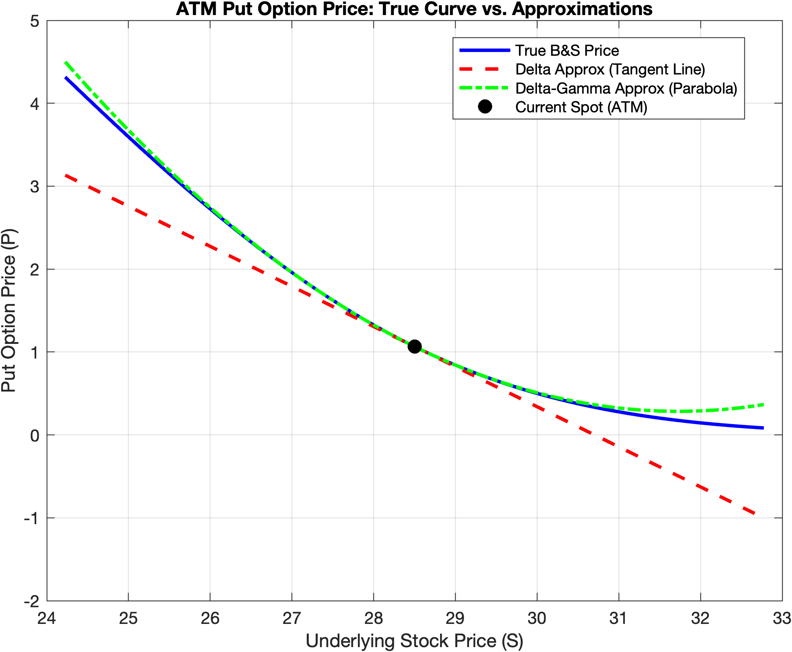
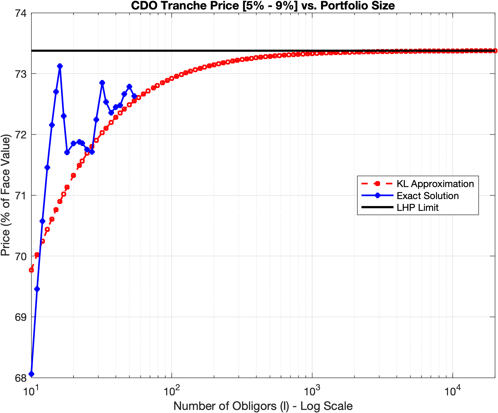

# Financial Engineering — Assignment 3

Market risk measurement (VaR/ES via five estimation methods) and derivatives
pricing under model risk, counterparty risk and portfolio credit risk. Pure
MATLAB, no external libraries beyond the Statistics and Machine Learning
Toolbox.

Financial Engineering, MSc in Mathematical Engineering — Politecnico di
Milano, AY 2025/26.

---

## The exercises

| # | Topic |
|---|---|
| 0 | Variance-Covariance (parametric Gaussian) VaR & ES |
| 1 | Historical Simulation, Weighted HS, Statistical Bootstrap, Gaussian PCA VaR/ES + plausibility checks, on three portfolios |
| 2 | Full Monte-Carlo vs. Delta-Normal VaR for a non-linear (stock + put) portfolio |
| 3 | Cliquet option pricing under counterparty risk (CVA from a bootstrapped CDS curve) |
| 4 | CDO tranche pricing under the Vasicek/Gaussian-copula model — Exact, LHP and Kullback-Leibler approximations |

Full write-up of methodology, results and discussion in
[`Report.pdf`](Report.pdf).

## Selected results

| Exercise | Result |
|---|---|
| 0 — Variance-Covariance | VaR₉₅% = €244,868 · ES₉₅% = €308,431 (1-day) |
| 1a — HS vs. Bootstrap | VaR₉₉% = €54,613 (HS) vs. €60,055 (Bootstrap, $M=200$) |
| 1b — WHS ($\lambda=0.98$) | VaR₉₉% = €401,827 · ES₉₉% = €481,404 (1-day) |
| 1c — Gaussian PCA (25 assets) | **1 principal component** already gets the 10-day VaR within 0.67% of the full 25-factor Gaussian model |
| 2 — Full MC vs. Delta-Normal | €518.67 vs. €489.47 — a 6% gap driven by the fat-tailed realized return distribution (2008 crisis window), *not* by unhedged convexity (gamma ≈ 0, deep ITM) |
| 3 — Cliquet + CVA | Theoretical price €21.45M; CVA €241k (1.13% of price) |
| 4 — CDO tranches (Vasicek) | LHP limit: 73.38% (mezzanine 5–9%), 51.34% (equity 0–5%); Exact solution computable up to $I\approx58$ before `nchoosek` loses precision, KL approximation converges monotonically to LHP throughout |

Two things worth flagging, because they are easy to get wrong:

**The Ex.2 VaR gap is not a convexity story.** The position (stock + same
number of deep-ITM puts) is almost delta-neutral and has gamma ≈ 0, so a
Delta-Gamma correction would add nothing here — the gap between Full
Monte-Carlo and Delta-Normal VaR comes entirely from Full MC sampling the
*actual* fat-tailed 2008–2010 return distribution instead of assuming
Gaussian returns.

**One principal component is (almost) all you need (Ex.1c).** For an
equally-weighted 25-stock EuroStoxx portfolio, the first eigenvalue of the
covariance matrix already captures essentially all systematic risk — a
single common equity-market factor — so the Gaussian-PCA VaR with $n=1$
already beats the 1% accuracy threshold against the full model.



*Exercise 2 — Delta/Delta-Gamma approximation quality, evaluated at-the-money
(rather than on the actual deep-ITM position) precisely because that is
where gamma — and the benefit of a second-order correction — is largest.*



*Exercise 4 — Mezzanine tranche [5%–9%] price vs. portfolio size $I$. The
exact Binomial solution (blue) is only computable up to $I\approx58$ before
`nchoosek` loses floating-point precision; the Kullback-Leibler approximation
(red) tracks it closely and converges monotonically to the Large
Homogeneous Portfolio limit (black) as $I\to\infty$.*

## Method notes (non-obvious choices)

- **Ex. 0/1** — trading days differ across stocks, so any missing quote is
  filled with the previous available price before computing log-returns
  (rather than dropping the date), as required by the assignment.
- **Ex. 1b (WHS)** — the VaR order $i^\*$ is the *largest* scenario index
  whose cumulative exponential weight (worst-to-best loss) does not exceed
  the tail budget $1-\alpha$, matching the strict definition given in class
  rather than the looser "first index to cross the budget" convention.
- **Ex. 2** — Full Monte-Carlo is a genuine full-valuation historical
  simulation: each historical return scenario reprices the put via
  Black-Scholes with time-to-maturity reduced by exactly one day, not a
  naive re-scaling.
- **Ex. 3** — CVA is computed via the tower-property shortcut valid for a
  stream of *non-negative* cash flows: each caplet's own value is weighted by
  ISP's cumulative default probability up to its own payment date, summed
  additively — no need to track exposure at every possible default time.
- **Ex. 4** — the "Exact" Binomial-mixture model is deliberately run only up
  to the portfolio size where `nchoosek` starts losing floating-point
  precision (the assignment explicitly asks for this), after which only the
  LHP and KL models remain evaluable, up to $I = 2\times10^4$.

## Repository layout

```
runAss3.m              Main script — runs all 5 exercises end-to-end
Ex_0/                   Exercise 0: Variance-Covariance VaR & ES
Ex_1/                   Exercise 1: HS, WHS, Bootstrap, PCA (subfolders Ex_1a/b/c)
Ex_2/                   Exercise 2: Full Monte-Carlo & Delta-Normal VaR
Ex_3/                   Exercise 3: Cliquet pricing + CVA
Ex_4/                   Exercise 4: CDO tranche pricing (Vasicek/LHP/KL)
Bootstrap/              Zero-coupon curve bootstrapping utilities
CDS_Bootstrap/          CDS survival-probability bootstrapping utilities
Utilities/              Shared helpers (date handling, data selection, etc.)
Mkt_data/               Market data (EuroStoxx 50 historical prices)
figures/                Figures referenced by this README and by the report
Report.pdf              Full written report (methodology, results, discussion)
```

## Running it

```matlab
runAss3
```

The script adds all subfolders to the MATLAB path automatically
(`addpath(genpath(...))`), loads the required market data from `Mkt_data/`
and `Bootstrap/MktData_CurveBootstrap.xls`, and executes all five exercises
in sequence, printing a formatted report for each one to the console and
producing the relevant plots. A fixed random seed (`rng(42)`) is set at the
top of the script so that the Statistical Bootstrap results (Exercise 1a)
are reproducible.

Total runtime is a few seconds, with the exception of the CDO tranche plots
in Exercise 4, which evaluate the KL approximation over a 100-point
logarithmic grid of portfolio sizes and take a few seconds longer.

## Requirements

- MATLAB (developed and tested on R2024a)
- **Statistics and Machine Learning Toolbox** — `normcdf`, `norminv`, `pcacov`, `jbtest`, `skewness`, `kurtosis`, `nchoosek`, ...
- Financial Toolbox is **not** required — all pricing/curve routines are implemented from scratch.

No external MATLAB packages or toolboxes beyond the above are needed.

## Author

Filippo Cuoghi
